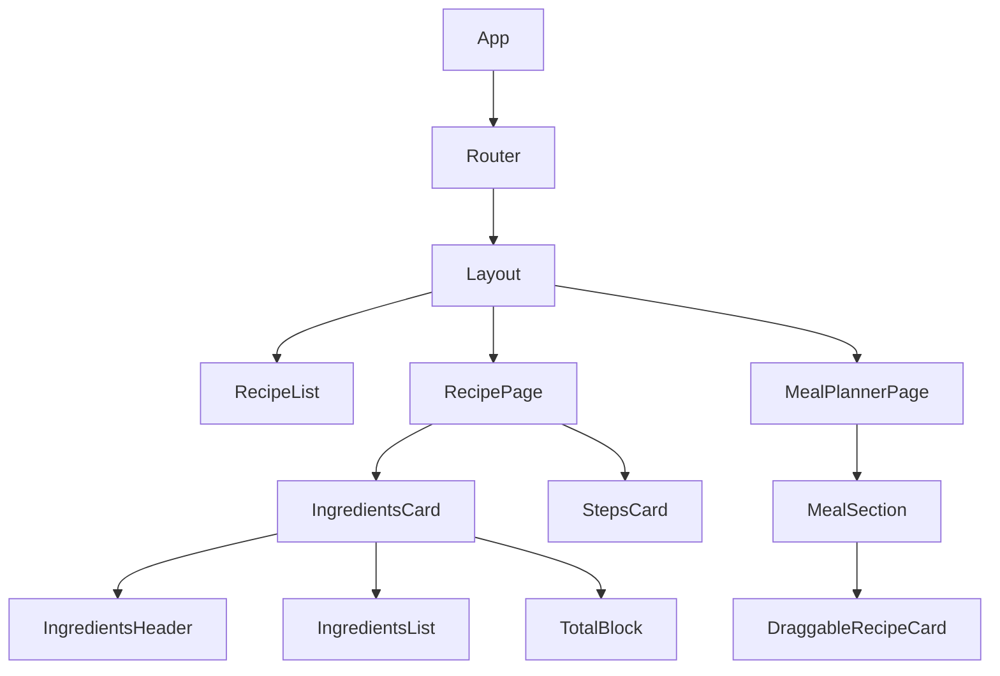
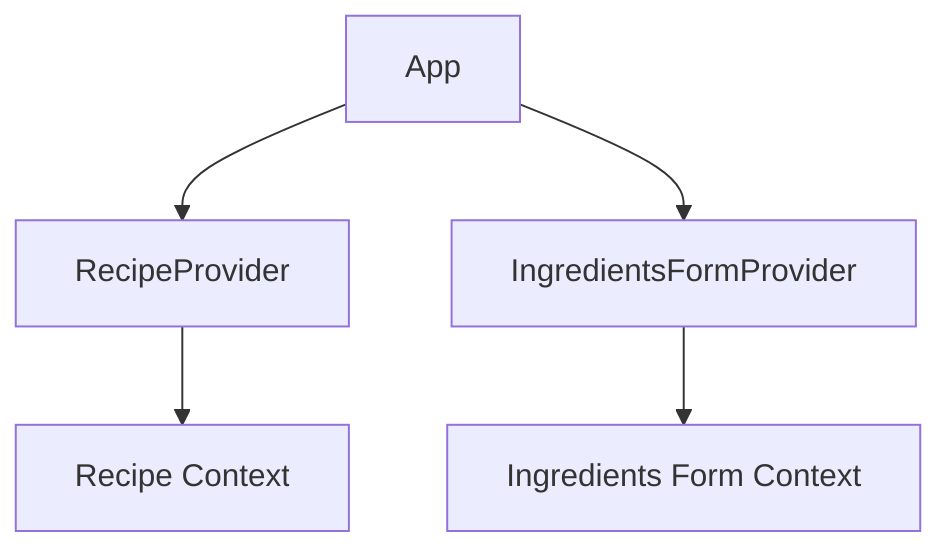
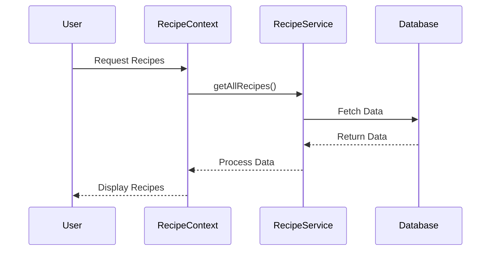
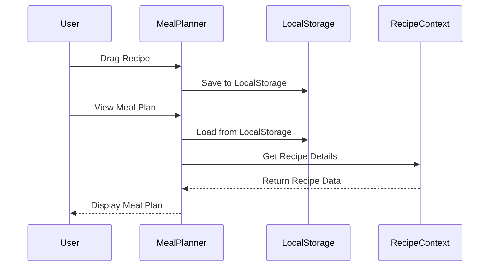

# NutriForge Application Documentation

## Table of Contents
1. [Application Overview](#application-overview)
2. [Architecture](#architecture)
3. [Component Structure](#component-structure)
4. [State Management](#state-management)
5. [Data Flow](#data-flow)
6. [Key Features](#key-features)

## Application Overview

NutriForge is a React-based application for managing recipes and meal planning. The application allows users to:
- Browse and view recipes
- Calculate nutritional information
- Plan meals
- Drag and drop recipes into meal plans

## Architecture

### Tech Stack
- React 19
- TypeScript
- Vite
- React Router
- Context API for state management
- TailwindCSS for styling

### Directory Structure
```
src/
├── assets/         # Static assets
├── components/     # React components
│   ├── Layout/    # Layout components
│   ├── Recipe/    # Recipe-related components
│   ├── MealPlanner/ # Meal planning components
│   └── ui/        # Reusable UI components
├── context/       # React Context providers
├── hooks/         # Custom React hooks
├── lib/          # Utility libraries
├── services/     # API services
├── types/        # TypeScript type definitions
└── util/         # Utility functions
```

## Component Structure

### Main Components Hierarchy


### Context Providers


## State Management

### Context Structure

#### RecipeContext
```typescript
interface RecipeContextType {
  recipes: Recipe[];
  isLoading: boolean;
}
```

#### IngredientsFormContext
```typescript
interface IngredientsFormState {
  ingredients: Ingredient[];
  totalWeight: number;
  totalMacros: {
    proteins: number;
    carbs: number;
    fats: number;
    kcal: number;
  };
  isLocked: boolean;
  isMacrosOpen: boolean;
}
```

## Data Flow

### Recipe Data Flow


### Meal Planning Flow


## Key Features

### 1. Recipe Management
- View recipe details
- Calculate nutritional information
- Scale ingredients
- View cooking steps

### 2. Meal Planning
- Drag and drop interface
- Meal categorization (breakfast, lunch, dinner)
- Nutritional summary
- Local storage persistence

### 3. Ingredients Management
- Dynamic ingredient scaling
- Macro nutrient calculations
- Lock/unlock scaling mode
- Total weight adjustment

### 4. UI/UX Features
- Responsive design
- Drag and drop functionality
- Interactive forms
- Real-time calculations

## Component Details

### RecipePage
- Displays detailed recipe information
- Manages ingredient scaling
- Shows cooking steps
- Provides meal planning integration

### MealPlannerPage
- Implements drag and drop functionality
- Manages meal categories
- Calculates total nutrition
- Persists data in localStorage

### IngredientsCard
- Handles ingredient scaling
- Calculates macros
- Manages ingredient weights
- Provides total nutrition information

## State Management Details

### Recipe Context
- Manages recipe data
- Handles loading states
- Provides recipe access throughout the app

### Ingredients Form Context
- Manages ingredient state
- Handles scaling calculations
- Manages form UI state
- Calculates nutritional information

## Best Practices Implemented

1. **Type Safety**
   - TypeScript throughout the application
   - Proper type definitions
   - Type-safe props and state

2. **State Management**
   - Context API for global state
   - Local state for component-specific data
   - Immutable state updates

3. **Performance**
   - Efficient re-renders
   - Proper cleanup in effects
   - Optimized calculations

4. **Code Organization**
   - Feature-based structure
   - Reusable components
   - Clear separation of concerns

## Development Guidelines

1. **Adding New Features**
   - Create new components in appropriate directories
   - Add types in types directory
   - Update context if needed
   - Follow existing patterns

2. **State Management**
   - Use context for global state
   - Use local state for component-specific data
   - Keep state updates immutable

3. **Styling**
   - Use TailwindCSS classes
   - Follow existing design patterns
   - Maintain responsive design

4. **Testing**
   - Test components in isolation
   - Test state management
   - Test user interactions

## Common Patterns

1. **Component Structure**
```typescript
interface Props {
  // Props definition
}

export function Component({ prop1, prop2 }: Props) {
  // State and hooks
  const [state, setState] = useState();
  
  // Effects
  useEffect(() => {
    // Effect logic
  }, []);
  
  // Handlers
  const handleEvent = () => {
    // Event handling
  };
  
  // Render
  return (
    // JSX
  );
}
```

2. **Context Usage**
```typescript
// Context definition
const Context = createContext<ContextType>(defaultValue);

// Provider component
export function Provider({ children }: { children: ReactNode }) {
  const [state, setState] = useState();
  
  return (
    <Context.Provider value={{ state, setState }}>
      {children}
    </Context.Provider>
  );
}

// Hook for using context
export function useContext() {
  return useContext(Context);
}
```